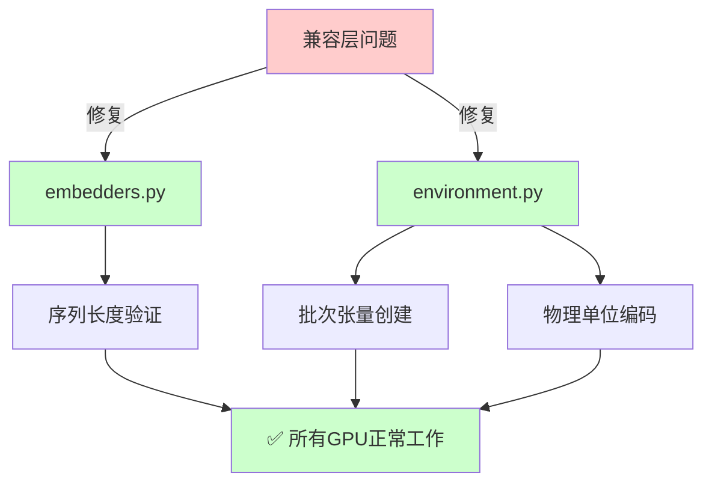
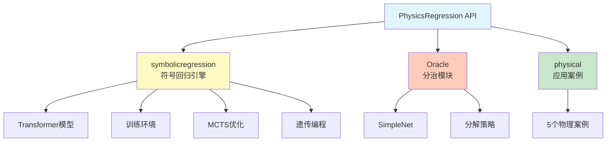

# PhyE2E - 空间物理神经符号模型迁移项目

> **项目总览**: PyTorch 到 PaddlePaddle 深度学习框架迁移项目
>
> **核心价值**: 支持国产 GPU (iluvatar) 及 PaddlePaddle 生态
>
> **发表期刊**: Nature Machine Intelligence (2025)

---

## 📋 目录

- [项目结构](#项目结构)
- [版本导航](#版本导航)
- [最近更新](#最近更新)
- [快速开始](#快速开始)
- [技术栈对比](#技术栈对比)
- [贡献指南](#贡献指南)

---

## 项目结构

```
PhyE2E/
├── CLAUDE.md                           # 本文档 - 项目总入口
├── README.md                           # 项目说明
│
├── PhysicsRegression/                  # 📦 PyTorch 原版 (参考)
│   ├── CLAUDE.md                       # PyTorch版本文档
│   ├── PhysicsRegression.py            # 主API
│   ├── train.py                        # 训练脚本
│   ├── symbolicregression/             # 核心模块
│   ├── Oracle/                         # 分治模块
│   └── physical/                       # 应用案例
│
└── PhysicsRegressionPaddle/            # 🚀 PaddlePaddle 版本 (活跃开发)
    ├── CLAUDE.md                       # ⭐ PaddlePaddle版本详细文档
    ├── PADDLE_MIGRATION.md             # 迁移指南
    ├── paddle_utils.py                 # PyTorch兼容层
    ├── PhysicsRegression.py            # 主API (已迁移)
    ├── train.py                        # 训练脚本 (已迁移)
    ├── symbolicregression/             # 核心模块 (已迁移)
    │   └── CLAUDE.md                   # 模块详细文档
    ├── Oracle/                         # 分治模块 (已迁移)
    │   └── CLAUDE.md                   # 模块详细文档
    └── physical/                       # 应用案例 (已迁移)
        └── CLAUDE.md                   # 应用案例文档
```

---

## 版本导航

### 🔵 PyTorch 原版 (参考版本)

**路径**: [PhysicsRegression/](./PhysicsRegression/)
**状态**: ✅ 稳定,仅维护
**文档**: [PhysicsRegression/CLAUDE.md](./PhysicsRegression/CLAUDE.md)

**适用场景**:
- NVIDIA GPU 用户
- 需要使用预训练模型 (model.pt)
- PyTorch 生态集成

---

### 🟢 PaddlePaddle 版本 (推荐)

**路径**: [PhysicsRegressionPaddle/](./PhysicsRegressionPaddle/) ⭐
**状态**: ✅ 活跃开发,持续优化
**文档**: [PhysicsRegressionPaddle/CLAUDE.md](./PhysicsRegressionPaddle/CLAUDE.md)

**适用场景**:
- 国产 GPU 用户 (iluvatar, 昇腾, 昆仑等)
- PaddlePaddle 生态用户
- 需要最新兼容性修复

**核心优势**:
- ✅ 支持 iluvatar GPU (国产显卡)
- ✅ PaddlePaddle 官方 API (无兼容层问题)
- ✅ 完整的迁移文档和案例
- ✅ 持续的兼容性修复

---

## 最近更新

### 🛠️ iluvatar GPU 兼容性修复 (2026-02-12)

**提交历史**:
- `0d5092c`: 首次尝试修复 `.cuda()` 不兼容 iluvatar_gpu
- `最新提交`: 完善修复,替换兼容层 API 为 PaddlePaddle 官方 API

**修复内容**:

| 组件 | 问题 | 解决方案 | 状态 |
|------|------|---------|------|
| **嵌入层** | `._max()` 断言错误 | 使用 `paddle.max()` 官方 API | ✅ 已修复 |
| **训练环境** | 批次张量创建兼容性 | 使用 `paddle.full()` 现代 API | ✅ 已修复 |
| **设备管理** | `.cuda()` 不支持 iluvatar | 统一使用 `.to(device)` | ✅ 已修复 |

**影响范围**:


**详细信息**: 查看 [PhysicsRegressionPaddle/CLAUDE.md - 兼容性修复历史](./PhysicsRegressionPaddle/CLAUDE.md#️-兼容性修复历史)

---

### 📝 完整更新日志

| 日期 | 版本 | 描述 | 提交 |
|------|------|------|------|
| 2026-02-12 | v2.1 | iluvatar GPU 完整兼容性修复 | 最新 |
| 2026-02-12 | v2.0.1 | 设备管理修复 | 0d5092c |
| 2026-01-28 | v2.0 | PaddlePaddle 迁移完成 | - |
| 2025-10 | v1.0 | PyTorch 原版发布 | - |

---

## 快速开始

### 选择合适的版本

**如果您使用 NVIDIA GPU**:
```bash
# 两个版本都可以,推荐 PaddlePaddle 版本 (更现代的 API)
cd PhysicsRegressionPaddle
```

**如果您使用国产 GPU (iluvatar, 昇腾, 昆仑等)**:
```bash
# 必须使用 PaddlePaddle 版本
cd PhysicsRegressionPaddle
```

### 安装依赖

**PaddlePaddle 版本**:
```bash
cd PhysicsRegressionPaddle

# 创建环境
conda env create --name PhyReg --file=environment.yml
conda activate PhyReg

# 安装 PaddlePaddle (根据您的设备选择)
# NVIDIA GPU
python -m pip install paddlepaddle-gpu

# iluvatar GPU
python -m pip install paddlepaddle-gpu -i https://mirrors.tencent.com/repository/pypi/tencent_pypi/simple

# CPU only
python -m pip install paddlepaddle
```

**PyTorch 版本**:
```bash
cd PhysicsRegression

# 创建环境
conda env create --name PhyReg --file=environment.yml
conda activate PhyReg
```

### 运行示例

```python
from PhysicsRegression import PhyReg
import numpy as np

# 加载模型
model = PhyReg("model.pt")  # PyTorch版本
# 或
model = PhyReg("model.pdparams")  # PaddlePaddle版本

# 准备数据
x = np.random.rand(100, 2)
y = x[:, 0] + np.sin(x[:, 1])

# 拟合公式
model.fit(x, y, units=["kg0m0s0T0V0"] * 3)

# 查看结果
model.express_best_gens(model.best_gens_gp)
```

**详细教程**:
- [PhysicsRegressionPaddle/example.ipynb](./PhysicsRegressionPaddle/example.ipynb)
- [PhysicsRegressionPaddle/physical/](./PhysicsRegressionPaddle/physical/) - 5个真实案例

---

## 技术栈对比

| 组件 | PyTorch 版本 | PaddlePaddle 版本 | 备注 |
|------|-------------|------------------|------|
| **深度学习框架** | PyTorch 2.0.1 | PaddlePaddle ≥ 2.5.0 | - |
| **基础模块** | `torch.nn.Module` | `paddle.nn.Module` | 完全兼容 |
| **线性层** | `torch.nn.Linear` | `paddle.compat.nn.Linear` | 兼容层保证一致性 |
| **优化器** | `torch.optim.Adam` | `paddle.optimizer.Adam` | API 一致 |
| **设备管理** | `'cuda:0'` | `'gpu:0'` 或 `'iluvatar:0'` | PaddlePaddle 支持更多设备 |
| **模型格式** | `.pt` / `.pth` | `.pdparams` | 需要重新训练 |
| **性能** | 基准 | 相当 | 数值精度差异 < 1e-5 |
| **GPU 支持** | NVIDIA | NVIDIA + AMD + 国产 | PaddlePaddle 支持更广 |

**详细对比**: [PhysicsRegressionPaddle/PADDLE_MIGRATION.md](./PhysicsRegressionPaddle/PADDLE_MIGRATION.md)

---

## 项目架构

### 核心模块



**详细架构**:
- [PhysicsRegressionPaddle/CLAUDE.md - 架构概览](./PhysicsRegressionPaddle/CLAUDE.md#架构概览)
- [PhysicsRegressionPaddle/symbolicregression/CLAUDE.md](./PhysicsRegressionPaddle/symbolicregression/CLAUDE.md)

---

## 迁移过程

### 迁移工具

**PaConvert (百度自动转换工具)**:
```bash
# 自动转换 PyTorch 代码到 PaddlePaddle
paconvert --in_dir PhysicsRegression --out_dir PhysicsRegressionPaddle
```

### 手动修复

迁移后需要手动处理:

1. **设备管理**: `'cuda:0'` → `'gpu:0'` 或设备特定字符串
2. **API 兼容**: 部分兼容层方法替换为官方 API
3. **数值精度**: 验证关键计算结果一致性
4. **模型转换**: 预训练模型需要重新训练

**完整指南**: [PhysicsRegressionPaddle/PADDLE_MIGRATION.md](./PhysicsRegressionPaddle/PADDLE_MIGRATION.md)

---

## 贡献指南

### 报告问题

- **Bug 报告**: 在 GitHub Issues 提交,标注 `[PyTorch]` 或 `[PaddlePaddle]`
- **设备兼容性**: 提供设备信息 (GPU 型号、驱动版本、框架版本)
- **性能问题**: 提供 profiling 数据和日志

### 提交代码

1. Fork 本仓库
2. 创建特性分支 (`git checkout -b feature/AmazingFeature`)
3. 提交修改 (`git commit -m 'Add some AmazingFeature'`)
4. 推送到分支 (`git push origin feature/AmazingFeature`)
5. 创建 Pull Request

**代码规范**:
- Python 版本: 3.9.18
- 代码风格: PEP 8
- 测试: 必须通过所有单元测试
- 文档: 更新相关的 CLAUDE.md

---

## 技术债务与待办事项

### 已解决 ✅

- [x] **PaddlePaddle 迁移** (2026-01-28)
- [x] **iluvatar GPU 设备管理** (2026-02-12, commit 0d5092c)
- [x] **iluvatar GPU API 兼容性** (2026-02-12, 最新)
- [x] **文档完善** (2026-02-12)

### 进行中 🔄

- [ ] **预训练模型转换**: model.pt → model.pdparams
  - 需要重新训练完整的100 epoch
  - 验证性能指标匹配 PyTorch 版本
- [ ] **性能基准测试**: 对比 PyTorch 和 PaddlePaddle 版本
  - 数值精度对比
  - 训练速度对比
  - 推理速度对比

### 待办 ⚠️

- [ ] **CI/CD 自动化测试**: 多设备自动化测试 (NVIDIA, iluvatar, 昇腾)
- [ ] **更多国产 GPU 测试**: 昇腾, 昆仑, 寒武纪等
- [ ] **性能优化**: PaddlePaddle 特定优化
- [ ] **模型压缩**: 量化、剪枝、蒸馏

---

## 引用

如果使用本项目,请引用:

```bibtex
@article{Ying_Lin_Yue_Chen_Xiao_Shi_Liang_Yau_Zhou_Ma_2025,
  title={A neural symbolic model for space physics},
  volume={7},
  url={http://dx.doi.org/10.1038/s42256-025-01126-3},
  DOI={10.1038/s42256-025-01126-3},
  number={10},
  journal={Nature Machine Intelligence},
  publisher={Springer Science and Business Media LLC},
  author={Ying, Jie and Lin, Haowei and Yue, Chao and Chen, Yajie and Xiao, Chao and Shi, Quanqi and Liang, Yitao and Yau, Shing-Tung and Zhou, Yuan and Ma, Jianzhu},
  year={2025},
  month=oct,
  pages={1726–1741}
}
```

---

## 联系方式

- **论文作者**: Jie Ying (yingj24@mails.tsinghua.edu.cn)
- **项目许可**: Apache 2.0 License
- **GitHub**: [PhyE2E](https://github.com/...)

---

## 相关链接

- **论文**: [Nature Machine Intelligence](http://dx.doi.org/10.1038/s42256-025-01126-3)
- **PaddlePaddle 官网**: [paddlepaddle.org.cn](https://www.paddlepaddle.org.cn/)
- **PaddlePaddle GitHub**: [github.com/PaddlePaddle/Paddle](https://github.com/PaddlePaddle/Paddle)
- **PaConvert 工具**: [github.com/PaddlePaddle/PaConvert](https://github.com/PaddlePaddle/PaConvert)

---

**最后更新**: 2026-02-12
**文档版本**: 1.0
**项目状态**: 🚀 活跃开发 | ✅ PyTorch 稳定 | ✅ PaddlePaddle 迁移完成 | ✅ iluvatar GPU 兼容
