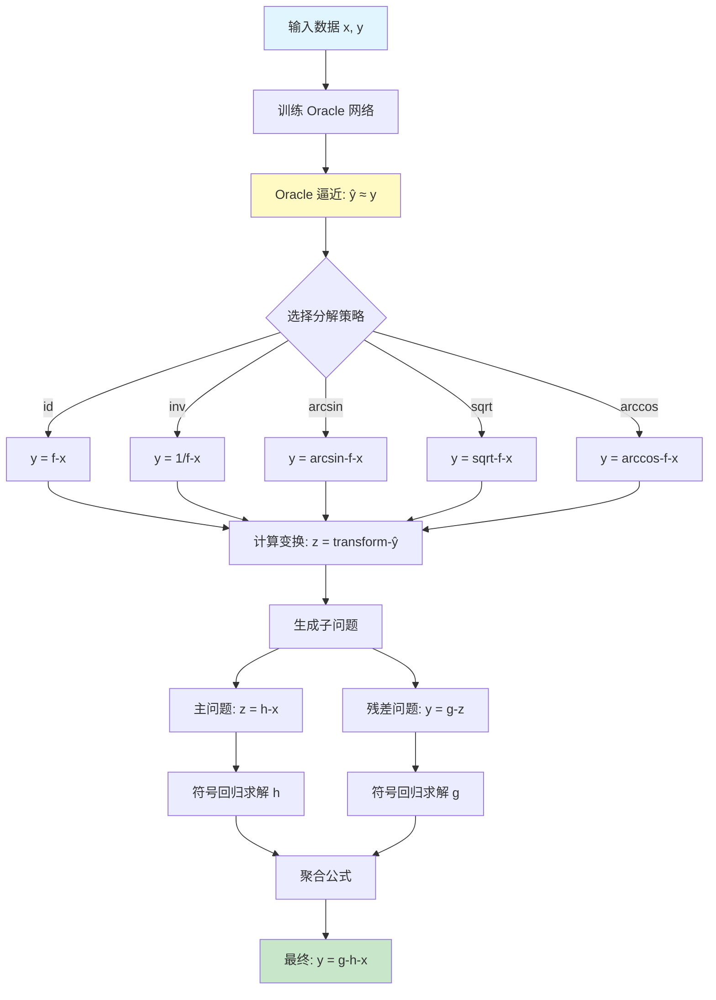

# Oracle - 分治策略模块

📍 **Root** > **Oracle**

---

## 📋 目录

- [模块概览](#模块概览)
- [目录结构](#目录结构)
- [核心原理](#核心原理)
- [公共接口](#公共接口)
- [分解策略](#分解策略)
- [使用示例](#使用示例)
- [开发指南](#开发指南)

---

## 模块概览

### 职责范围

`Oracle` 模块实现了**分治 (Divide-and-Conquer)** 策略,通过神经网络辅助将复杂的符号回归问题分解为多个简单子问题。

**核心思想**:
```
复杂问题: y = f(x)  →  分解  →  {y = g(h(x)), z = h(x)}
                                  ↓
                         分别求解 g 和 h
                                  ↓
                         组合: f(x) = g(h(x))
```

### 主要功能

1. **Oracle 神经网络训练**: 用简单 MLP 逼近目标函数
2. **启发式分解**: 应用数学变换 (反函数、开方等) 寻找分解点
3. **子问题生成**: 创建主问题和残差问题
4. **公式聚合**: 将子问题解组合为最终公式

### 适用场景

**适合使用 Oracle 的情况**:
- ✅ 公式复杂度高 (运算符 > 10)
- ✅ 数据点足够 (> 100 个样本)
- ✅ 存在明显的嵌套结构 (如 `sin(exp(x))`)
- ✅ Transformer 直接预测效果不佳

**不适合的情况**:
- ❌ 简单公式 (运算符 < 5)
- ❌ 数据点稀少 (< 50 个样本)
- ❌ 扁平结构 (如 `x_0 + x_1 + x_2`)

---

## 目录结构

```
Oracle/
├── CLAUDE.md              # 本文档
├── __init__.py            # 模块初始化
└── oracle.py              # Oracle 核心实现 (437 行)
    ├── oracle_fit()       # 训练 Oracle 网络
    ├── oracle_seperate()  # 应用分解策略
    ├── reverse()          # 聚合子公式
    └── OracleNet          # 简单 MLP 网络定义
```

---

## 核心原理

### 工作流程



### 数学原理

**目标**: 将 `y = f(x)` 分解为 `y = g(h(x))`

**步骤**:
1. **训练 Oracle**: 神经网络 `φ` 逼近 `f`
   ```
   φ(x) ≈ f(x) = y
   ```

2. **应用变换**: 选择合适的变换 `T`
   ```
   z = T(φ(x))
   ```

   例如:
   - `T = arcsin`: 若 `φ(x) = sin(h(x))`, 则 `z ≈ h(x)`
   - `T = sqrt`: 若 `φ(x) = h(x)²`, 则 `z ≈ h(x)`
   - `T = inv`: 若 `φ(x) = 1/h(x)`, 则 `z ≈ h(x)`

3. **求解子问题**:
   - 主问题: `z = h(x)` (简单函数)
   - 残差: `y = g(z)` (通常也简单)

4. **组合结果**: `f(x) = g(h(x))`

---

## 公共接口

### 核心函数

#### 1. `oracle_fit()`

训练 Oracle 神经网络。

**函数签名**:
```python
def oracle_fit(
    x,              # 输入数据 [N, n_vars]
    y,              # 目标值 [N, 1]
    oracle_net,     # Oracle 网络实例
    device="cuda",  # 设备
    epochs=100,     # 训练轮数
    lr=0.001,       # 学习率
    batch_size=32   # 批次大小
):
    """
    使用简单 MLP 拟合数据

    返回:
        trained_net: 训练好的网络
        loss_history: 训练损失历史
    """
```

**使用示例**:
```python
from Oracle.oracle import SimpleNet, Oracle

# 创建网络
oracle_net = SimpleNet(_in=x.shape[1])  # 变量数

# 训练
trained_net, losses = oracle_fit(
    x, y, oracle_net,
    epochs=100,
    lr=0.001
)

# 预测
y_pred = trained_net(x)
```

#### 2. `oracle_seperate()`

**位置**: `oracle.py:483-531`

应用分解策略（基于导数矩阵进行变量分离）。

**实际函数签名**:
```python
def oracle_seperate(
    self,
    diffs,              # 0/1/2阶导数矩阵 [n_vars, 3]
    mse,                # 均方误差
    use_oracle_types    # 分离策略列表 (如 ["id,add", "inv,mul"])
) -> tuple[list, list, list]:
    """
    基于差分矩阵进行变量分离

    参数:
        diffs: 导数矩阵 [n_vars, 3]
               - diffs[:, 0]: 0阶导数 (函数值)
               - diffs[:, 1]: 1阶导数
               - diffs[:, 2]: 2阶导数
        mse: Oracle拟合的均方误差
        use_oracle_types: 分离策略列表
               格式: ["apply_func,use_oracle_type", ...]
               - apply_func: 变换类型 ("id", "inv", "arcsin", "sqrt", "arccos")
               - use_oracle_type: 组合方式 ("add", "mul")
               例: ["id,add", "inv,mul", "arcsin,add"]

    返回:
        groups: 独立变量组 (list of variable indices)
        sep_type: 分离类型 (str)
        sep_idxs: 分离索引 (list)
```

#### 3. `reverse()`

聚合子公式。

**函数签名**:
```python
def reverse(
    main_exprs,     # 主问题解 (list of formulas)
    sub_exprs,      # 残差问题解 (list of formulas)
    strategy        # 使用的分解策略
):
    """
    将子公式组合为完整公式

    例:
        strategy = "arcsin"
        main_expr = "x_0 + x_1"       # h(x)
        sub_expr = "sin(y_0)"          # g(z), 其中 y_0 是中间变量

        result = "sin(x_0 + x_1)"      # g(h(x))

    返回:
        combined_exprs: 组合后的公式列表
    """
```

**组合规则**:

| 策略 | 分解 | 组合规则 |
|------|------|----------|
| `id` | `z = φ(x), y = g(z)` | `f(x) = g(φ(x))` |
| `inv` | `z = 1/φ(x), y = g(z)` | `f(x) = g(1/φ(x))` |
| `arcsin` | `z = arcsin(φ(x)), y = g(z)` | `f(x) = g(sin(z)) = g(sin(arcsin(φ(x)))) = g(φ(x))` |
| `sqrt` | `z = √φ(x), y = g(z)` | `f(x) = g(z²)` |
| `arccos` | `z = arccos(φ(x)), y = g(z)` | `f(x) = g(cos(z))` |

---

## 分解策略

### 策略详解

#### 1. **id (恒等变换)**

**适用**: 公式可以自然分解为嵌套结构

**示例**:
```python
# 目标: y = exp(x_0 + x_1)
# Oracle 学习到: φ(x) ≈ exp(x_0 + x_1)

# 分解:
# z = φ(x)           # 主问题: z ≈ exp(x_0 + x_1)
# y = z              # 残差: y = z (trivial)

# 最终: 直接求解 z = exp(x_0 + x_1)
```

#### 2. **inv (倒数变换)**

**适用**: 公式包含倒数关系

**示例**:
```python
# 目标: y = 1 / (x_0 + x_1)
# Oracle: φ(x) ≈ 1 / (x_0 + x_1)

# 分解:
# z = 1 / φ(x)       # z ≈ x_0 + x_1
# y = 1 / z          # y = 1/z

# 求解:
# h(x) = x_0 + x_1   (简单)
# g(z) = 1/z         (简单)
# 组合: y = g(h(x)) = 1/(x_0 + x_1)
```

#### 3. **arcsin (反正弦变换)**

**适用**: 公式包含正弦函数

**示例**:
```python
# 目标: y = sin(x_0 * x_1)
# Oracle: φ(x) ≈ sin(x_0 * x_1)

# 分解:
# z = arcsin(φ(x))   # z ≈ x_0 * x_1
# y = sin(z)         # y = sin(z)

# 求解:
# h(x) = x_0 * x_1   (简单)
# g(z) = sin(z)      (简单)
# 组合: y = sin(x_0 * x_1)
```

#### 4. **sqrt (开方变换)**

**适用**: 公式包含平方项

**示例**:
```python
# 目标: y = (x_0 + x_1)²
# Oracle: φ(x) ≈ (x_0 + x_1)²

# 分解:
# z = √φ(x)          # z ≈ x_0 + x_1
# y = z²             # y = z²

# 求解:
# h(x) = x_0 + x_1   (简单)
# g(z) = z²          (简单)
```

#### 5. **arccos (反余弦变换)**

**适用**: 公式包含余弦函数

**原理**: 类似 `arcsin`,用于 `cos` 函数

---

## 使用示例

### 完整工作流

```python
from Oracle.oracle import SimpleNet, Oracle
from PhysicsRegression import PhyReg
import numpy as np

# 1. 准备复杂数据
x = np.random.rand(200, 2)
y = np.sin(x[:, 0] * x[:, 1])  # 复杂公式

# 2. 创建并训练 Oracle (需通过 Oracle 类)
# 注意：实际使用时通过 PhyReg.fit(use_Divide=True) 自动完成

# 3. 分解问题
result = oracle_seperate(
    x, y, oracle_net,
    strategy="auto",  # 自动选择
    threshold=0.95
)

print(f"使用策略: {result['strategy']}")
print(f"分解质量: {result['score']:.3f}")

# 4. 分别求解子问题
model = PhyReg("model.pt")

# 主问题
model.fit(result["main_x"], result["main_y"])
main_formulas = model.best_gens

# 残差问题
model.fit(result["sub_x"], result["sub_y"])
sub_formulas = model.best_gens

# 5. 组合公式
final_formulas = reverse(
    main_formulas,
    sub_formulas,
    result["strategy"]
)

print("最终公式:")
model.express_best_gens(final_formulas)
```

### 集成到 PhyReg

```python
# PhysicsRegression.py 中已集成
from PhysicsRegression import PhyReg

model = PhyReg("model.pt")
model.fit(
    x, y,
    use_Divide=True,  # 启用 Oracle 分治
    # ... 其他参数
)

# 内部会自动:
# 1. 训练 Oracle
# 2. 尝试分解
# 3. 求解子问题
# 4. 组合结果
```

---

## 开发指南

### SimpleNet 架构

**位置**: `oracle.py:21-36`

**实际实现** (项目中的网络类名为 SimpleNet，而非文档中之前提到的 OracleNet):
```python
class SimpleNet(nn.Module):
    def __init__(self, _in):
        super().__init__()
        self.linear1 = nn.Linear(_in, 128)
        self.linear2 = nn.Linear(128, 128)
        self.linear3 = nn.Linear(128, 64)
        self.linear4 = nn.Linear(64, 64)
        self.linear5 = nn.Linear(64, 1)

    def forward(self, x):
        x = torch.tanh(self.linear1(x))
        x = torch.tanh(self.linear2(x))
        x = torch.tanh(self.linear3(x))
        x = torch.tanh(self.linear4(x))
        x = self.linear5(x)  # 注意：最后一层无激活函数
        return x
```

**详细架构**:
```
输入: x [batch, n_vars]
  ↓
Linear1: [batch, n_vars] → [batch, 128] → tanh
  ↓
Linear2: [batch, 128] → [batch, 128] → tanh
  ↓
Linear3: [batch, 128] → [batch, 64] → tanh
  ↓
Linear4: [batch, 64] → [batch, 64] → tanh
  ↓
Linear5: [batch, 64] → [batch, 1] (无激活函数)
  ↓
输出: [batch, 1]
```

**参数配置表**:
| 层名称 | 类型 | 输入维度 | 输出维度 | 激活函数 | 参数数量 |
|--------|------|---------|---------|---------|---------|
| linear1 | Linear | n_vars | 128 | tanh | n_vars×128 + 128 |
| linear2 | Linear | 128 | 128 | tanh | 16,512 |
| linear3 | Linear | 128 | 64 | tanh | 8,256 |
| linear4 | Linear | 64 | 64 | tanh | 4,160 |
| linear5 | Linear | 64 | 1 | None | 65 |

**设计理念**:
- **5层全连接网络**: 足够的容量逼近复杂函数
- **tanh激活函数**: 相比ReLU，tanh在[-1,1]范围内平滑，适合函数逼近
- **逐渐降维**: 128 → 128 → 64 → 64 → 1，提取抽象特征
- **无输出激活**: 最后一层无激活函数，支持任意值域的回归

**自定义架构**:
```python
class CustomOracle(nn.Module):
    def __init__(self, input_dim):
        super().__init__()
        # 更深的网络
        self.layers = nn.Sequential(
            nn.Linear(input_dim, 128),
            nn.BatchNorm1d(128),
            nn.ReLU(),
            nn.Dropout(0.2),

            nn.Linear(128, 128),
            nn.BatchNorm1d(128),
            nn.ReLU(),
            nn.Dropout(0.2),

            nn.Linear(128, 1)
        )

    def forward(self, x):
        return self.layers(x)

# 使用
oracle = CustomOracle(input_dim=x.shape[1])
oracle, _ = oracle_fit(x, y, oracle, epochs=200)
```

### 添加新策略

**步骤**:

1. **在 `oracle_seperate()` 中添加变换**:
```python
def oracle_seperate(x, y, oracle_net, strategy="auto", threshold=0.95):
    # ... 现有代码

    if strategy == "log":  # 新策略
        # 应用对数变换
        y_pred = oracle_net(x)
        z = torch.log(y_pred + 1e-8)  # 避免 log(0)

        # 计算分解质量
        # ... 评估代码

        return {
            "main_x": x,
            "main_y": z,
            "sub_x": z_solved,
            "sub_y": y,
            "strategy": "log",
            "score": score
        }
```

2. **在 `reverse()` 中添加组合规则**:
```python
def reverse(main_exprs, sub_exprs, strategy):
    # ... 现有代码

    if strategy == "log":
        # z = log(φ(x)), y = g(z)
        # => y = g(log(φ(x)))
        # 需要求 φ(x) = exp(z)
        for main_expr, sub_expr in zip(main_exprs, sub_exprs):
            # 将 main_expr 中的变量替换为 exp(...)
            combined = substitute_with_exp(sub_expr, main_expr)
            result.append(combined)
```

### 调试技巧

**1. 可视化 Oracle 拟合**:
```python
import matplotlib.pyplot as plt

# 训练 Oracle
oracle, losses = oracle_fit(x, y, oracle_net)

# 绘制拟合效果
y_pred = oracle(x).detach().cpu().numpy()
plt.scatter(y, y_pred, alpha=0.5)
plt.plot([y.min(), y.max()], [y.min(), y.max()], 'r--')
plt.xlabel("True y")
plt.ylabel("Predicted y")
plt.title(f"Oracle R² = {r2_score(y, y_pred):.3f}")
plt.show()

# 绘制训练损失
plt.plot(losses)
plt.xlabel("Epoch")
plt.ylabel("Loss")
plt.yscale("log")
plt.show()
```

**2. 评估分解质量**:
```python
def evaluate_separation(result):
    """评估分解是否有意义"""
    main_x, main_y = result["main_x"], result["main_y"]
    sub_x, sub_y = result["sub_x"], result["sub_y"]

    # 检查 1: 主问题是否比原问题简单?
    main_complexity = estimate_complexity(main_x, main_y)
    original_complexity = estimate_complexity(x, y)

    print(f"原问题复杂度: {original_complexity}")
    print(f"主问题复杂度: {main_complexity}")

    # 检查 2: 残差问题是否也简单?
    sub_complexity = estimate_complexity(sub_x, sub_y)
    print(f"残差复杂度: {sub_complexity}")

    # 好的分解: main_complexity < original_complexity
    #          sub_complexity < original_complexity
```

**3. 日志记录**:
```python
import logging

logging.basicConfig(level=logging.DEBUG)
logger = logging.getLogger("Oracle")

def oracle_seperate(x, y, oracle_net, strategy="auto"):
    logger.info(f"开始分解, 策略={strategy}")

    # ... 分解逻辑

    logger.debug(f"主问题形状: {main_x.shape}")
    logger.debug(f"残差形状: {sub_x.shape}")
    logger.info(f"分解完成, 质量={score:.3f}")

    return result
```

### 性能优化

**1. Oracle 训练加速**:
```python
# 使用更大的批次
oracle_fit(x, y, oracle_net, batch_size=128)

# 早停
oracle_fit(x, y, oracle_net, early_stopping_patience=10)

# GPU 加速
oracle_fit(x, y, oracle_net, device="cuda")
```

**2. 策略并行评估**:
```python
from multiprocessing import Pool

def evaluate_strategy_parallel(x, y, oracle_net):
    strategies = ["id", "inv", "arcsin", "arccos", "sqrt"]

    with Pool(5) as pool:
        results = pool.starmap(
            oracle_seperate,
            [(x, y, oracle_net, s) for s in strategies]
        )

    # 选择最佳
    best = max(results, key=lambda r: r["score"])
    return best
```

---

## ⚠️ 已知问题

本节记录代码中已知的bug和潜在问题，供开发者注意。

### 问题 #1: "arccin" 拼写错误

**位置**: `oracle.py:836`

**问题描述**:
```python
# 第836行
"arccin" in use_seperate_type and  # ❌ 错误：应为 "arcsin"
```

**影响**: 当使用 `arcsin` 分离策略时，由于拼写错误，条件判断可能失败

**修复建议**:
```python
# 修正为:
"arcsin" in use_seperate_type and
```

**临时解决方法**: 在调用时同时提供两种拼写：
```python
use_seperate_type = ["arcsin", "arccin"]  # 同时包含正确和错误拼写
```

---

### 问题 #2: 返回值数量不一致

**位置**: `oracle.py:约151行附近`

**问题描述**: 某些分支返回2个值，某些返回3个值，可能导致解包错误

**影响**: 调用方使用多变量赋值时可能出现 `ValueError: not enough values to unpack`

**修复建议**: 统一所有分支的返回值数量

---

### 问题 #3: 文档与实际代码不一致

**影响范围**: 多处函数签名与文档描述不符

**已确认的不一致**:
1. 网络类名: 文档说 `OracleNet`，实际是 `SimpleNet`
2. `oracle_seperate()` 参数: 实际签名与文档描述完全不同
3. 方法所属: `oracle_fit` 是 `Oracle` 类的方法，非独立函数

**建议**: 以实际代码为准，本文档已根据实际代码进行修正

---

## 常见问题

### Q1: Oracle 拟合效果不好 (R² < 0.9)?

**原因**:
- 数据点太少
- 网络容量不足
- 训练轮数不够

**解决方法**:
```python
# 增加网络容量
oracle = SimpleNet(_in=x.shape[1])  # SimpleNet 固定使用 128→128→64→64→1 架构

# 增加训练轮数
oracle_fit(x, y, oracle, epochs=500)

# 调整学习率
oracle_fit(x, y, oracle, lr=0.0001)
```

### Q2: 所有策略分解质量都很低?

**说明**: 问题可能不适合分治

**建议**:
- 直接使用 Transformer 预测
- 尝试 MCTS/GP 优化
- 增加数据点数量

### Q3: 组合后的公式不正确?

**检查**:
```python
# 1. 验证子公式
print("主公式:", main_formulas[0])
print("残差公式:", sub_formulas[0])

# 2. 手动验证组合
z_pred = evaluate_formula(main_formulas[0], x)
y_pred = evaluate_formula(sub_formulas[0], z_pred)
print(f"组合后 R² = {r2_score(y, y_pred)}")

# 3. 检查策略对应关系
print(f"使用策略: {result['strategy']}")
```

---

## PaddlePaddle 迁移

### 关键修改

**OracleNet 定义**:
```python
# PyTorch → PaddlePaddle
import paddle
import paddle.nn as nn

class OracleNet(nn.Layer):  # 继承 nn.Layer 而非 nn.Module
    def __init__(self, input_dim, hidden_dim=64, output_dim=1):
        super().__init__()
        self.net = nn.Sequential(
            nn.Linear(input_dim, hidden_dim),
            nn.ReLU(),
            nn.Linear(hidden_dim, hidden_dim),
            nn.ReLU(),
            nn.Linear(hidden_dim, output_dim)
        )

    def forward(self, x):
        return self.net(x)
```

**训练循环**:
```python
# optimizer
optimizer = paddle.optimizer.Adam(
    parameters=oracle_net.parameters(),
    learning_rate=lr
)

# 训练步骤
for epoch in range(epochs):
    for batch_x, batch_y in dataloader:
        pred = oracle_net(batch_x)
        loss = nn.functional.mse_loss(pred, batch_y)

        loss.backward()
        optimizer.step()
        optimizer.clear_grad()
```

---

**最后更新**: 2026-01-22
**维护者**: PhysicsRegression Team
**相关文档**: [根目录 CLAUDE.md](../CLAUDE.md) | [符号回归模块](../symbolicregression/CLAUDE.md)
