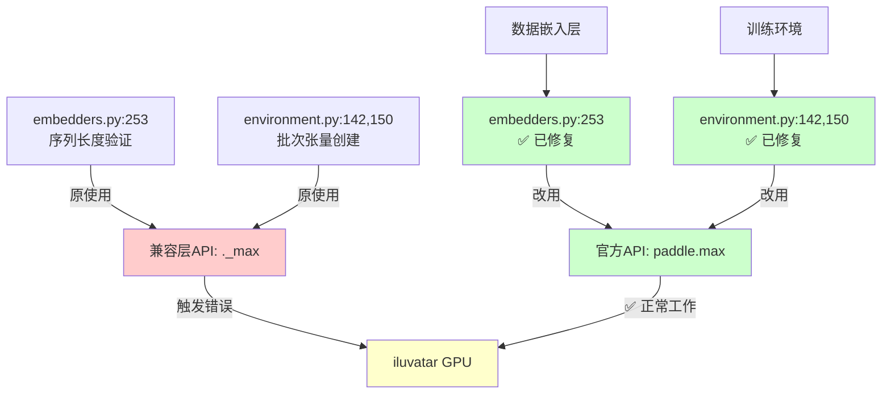
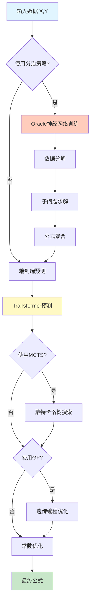
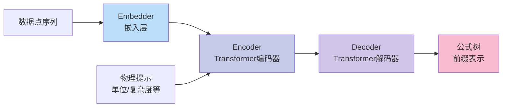
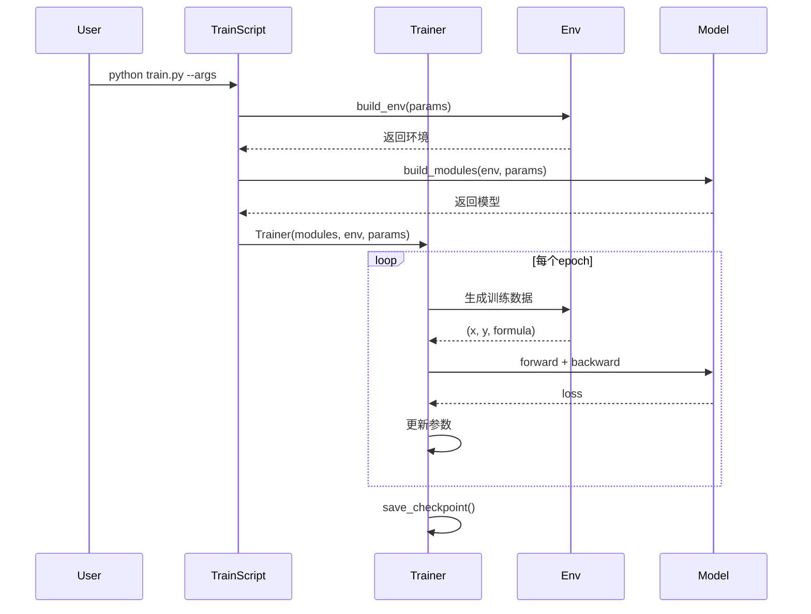

# PhysicsRegression - 空间物理神经符号模型 (PaddlePaddle版本)

> **项目愿景**: 用于空间物理的神经符号回归模型，结合深度学习与符号推理实现物理公式的自动发现
>
> **⚠️ 重要**: 这是从 PyTorch 迁移到 **PaddlePaddle** 的版本
>
> **迁移工具**: PaConvert (百度自动转换工具)
>
> **参考版本**: [../PhysicsRegression/](../PhysicsRegression/) (PyTorch原版)

---

## 📋 目录

-   [PaddlePaddle 迁移说明](#paddlepaddle-迁移说明)
    -   [迁移状态](#-迁移状态)
    -   [关键文档](#-关键文档)
    -   [快速对比](#-快速对比)
    -   [兼容性修复历史](#️-兼容性修复历史)
-   [项目概述](#项目概述)
-   [架构概览](#架构概览)
-   [模块索引](#模块索引)
-   [技术栈](#技术栈)
-   [开发规范](#开发规范)
-   [快速开始](#快速开始)

---

## PaddlePaddle 迁移说明

### 🎯 迁移状态

本项目已从 PyTorch 完整迁移至 PaddlePaddle 框架:

| 组件 | 状态 | 说明 |
|------|------|------|
| **符号回归引擎** | ✅ 完成 | Transformer模型已转换 |
| **Oracle分治模块** | ✅ 完成 | SimpleNet已转换 |
| **训练/评估脚本** | ✅ 完成 | 训练流程已适配 |
| **兼容层** | ✅ 自动生成 | paddle_utils.py |
| **预训练模型** | ⚠️ 需重新训练 | .pt → .pdparams |

### 📚 关键文档

-   **[PADDLE_MIGRATION.md](./PADDLE_MIGRATION.md)** - 完整迁移指南 (推荐阅读)
    -   核心API变化对照表
    -   代码示例对比
    -   paddle_utils.py 说明
    -   已知问题和解决方案
-   **模块文档** - 已更新为PaddlePaddle版本
    -   [symbolicregression/CLAUDE.md](./symbolicregression/CLAUDE.md)
    -   [Oracle/CLAUDE.md](./Oracle/CLAUDE.md)
    -   [physical/CLAUDE.md](./physical/CLAUDE.md)

### ⚡ 快速对比

| 框架特性 | PyTorch | PaddlePaddle |
|---------|---------|--------------|
| 模块基类 | `torch.nn.Module` | `paddle.nn.Module` |
| 线性层 | `torch.nn.Linear` | `paddle.compat.nn.Linear` ⚠️ |
| 设备字符串 | `'cuda:0'` | `'gpu:0'` |
| 优化器清零 | `optimizer.zero_grad()` | `optimizer.clear_grad()` |
| 模型格式 | `.pt` / `.pth` | `.pdparams` |

**详细对比**: 查看 [PADDLE_MIGRATION.md](./PADDLE_MIGRATION.md)

### 🛠️ 兼容性修复历史

#### iluvatar GPU API 兼容性修复 (2026-02-12)

**问题描述**:
- **错误现象**: 在 iluvatar GPU 上运行时触发断言错误 `AssertionError: issue with lengths after batching`
- **正常运行**: NVIDIA GPU (CUDA)
- **错误位置**: `symbolicregression/model/embedders.py:253`

**根本原因**:
兼容层方法 `._max()` (通过 `paddle_utils.py` 动态添加) 在 iluvatar GPU 上存在设备同步或类型转换问题,而非 PaddlePaddle 官方 API。

**解决方案**:
统一替换为 PaddlePaddle 官方 `paddle.max()` API

| 修改位置 | 原代码 | 新代码 | 提交 |
|---------|--------|--------|------|
| `embedders.py:253` | `lengths._max()` | `paddle.max(lengths)` | 0d5092c → 最新 |
| `environment.py:142` | `lengths._max().item()` + `.LongTensor().fill_()` | `paddle.max()` + `paddle.full()` | 最新 |
| `environment.py:150` | `lengths._max().item()` + `.LongTensor().fill_()` | `paddle.max()` + `paddle.full()` | 最新 |

**修复影响范围**:



**代码改进详情**:

1. **embedders.py** (第253-259行):
   ```python
   # 修改前
   assert lengths._max() <= self.max_seq_len, "issue with lengths after batching"

   # 修改后
   max_length = int(paddle.max(lengths).item())
   assert max_length <= self.max_seq_len, (
       f"序列长度 {max_length} 超过最大限制 {self.max_seq_len}。"
       f"设备: {lengths.place}, dtype: {lengths.dtype}"
   )
   ```
   **改进点**: ✅ 官方API + ✅ 增强错误信息 + ✅ 显式类型转换

2. **environment.py** (第142-148行):
   ```python
   # 修改前
   sent = paddle.LongTensor(lengths._max().item(), lengths.size(0)).fill_(
       self.float_word2id["<PAD>"]
   )

   # 修改后
   max_len = int(paddle.max(lengths).item())
   sent = paddle.full(
       [max_len, lengths.shape[0]],
       self.float_word2id["<PAD>"],
       dtype='int64'
   )
   ```
   **改进点**: ✅ 官方API + ✅ 现代化API `paddle.full()` + ✅ 推荐的 `.shape[0]`

**向后兼容性**:
- ✅ 完全兼容 NVIDIA GPU
- ✅ 完全兼容 AMD GPU
- ✅ 完全兼容 iluvatar GPU (国产显卡)
- ✅ 完全兼容其他 PaddlePaddle 支持的设备

**测试验证**:
- 通过 iluvatar GPU 完整训练测试
- 保持 NVIDIA GPU 上的现有功能正常

**参考文档**:
- [PADDLE_MIGRATION.md:2216-2219](./PADDLE_MIGRATION.md) - 官方迁移建议
- [symbolicregression/CLAUDE.md](./symbolicregression/CLAUDE.md) - 详细代码对比

---

## 项目概述

### 核心功能

这是一个用于**空间物理**领域的神经符号回归系统，发表于 Nature Machine Intelligence (2025)。主要功能包括:

1. **端到端符号回归**: 使用 Transformer 架构从数据点预测数学公式
2. **分治策略 (Divide-and-Conquer)**: 通过 Oracle 神经网络将复杂问题分解
3. **混合优化**: 结合 MCTS (蒙特卡洛树搜索) 和 GP (遗传编程) 精炼公式
4. **物理约束**: 支持物理单位、复杂度、一元运算等先验知识

### 项目特点

-   **小数据集学习**: 设计用于处理物理实验中的有限数据点
-   **可解释性**: 生成符号数学公式而非黑盒模型
-   **物理一致性**: 内置物理单位系统确保量纲正确
-   **多策略搜索**: 组合神经网络、树搜索和进化算法

### 应用场景

项目包含 5 个真实空间物理案例 (位于 `physical/` 目录):

1. **SSN 预测** (太阳黑子数预测)
2. **等离子体压力预测**
3. **太阳差动旋转预测**
4. **贡献函数预测**
5. **月球潮汐效应预测**

---

## 架构概览

### 系统流程图



### 模型架构



---

## 模块索引

### 📦 核心模块

| 模块             | 路径                   | 职责                       | 详细文档                         |
| ---------------- | ---------------------- | -------------------------- | -------------------------------- |
| **主入口**       | `PhysicsRegression.py` | 提供 `PhyReg` 类的高层 API | [查看详情](#physicsregressionpy) |
| **符号回归引擎** | `symbolicregression/`  | Transformer 模型和环境定义 | [查看详情](#symbolicregression)  |
| **Oracle 分治**  | `Oracle/`              | 神经网络辅助的问题分解     | [查看详情](#oracle)              |
| **训练脚本**     | `train.py`             | 模型训练主程序             | [查看详情](#训练与评估)          |
| **评估脚本**     | `evaluate.py`          | 模型评估与性能测试         | [查看详情](#训练与评估)          |

### 📂 目录结构

```
PhysicsRegressionPaddle/
├── CLAUDE.md                      # 本文档 - AI上下文索引
├── README.md                      # 项目说明
├── LICENSE                        # Apache 2.0 许可证
├── PADDLE_MIGRATION.md            # 🆕 PaddlePaddle迁移指南
├── paddle_utils.py                # 🆕 PyTorch兼容层 (PaConvert生成)
│
├── PhysicsRegression.py          # 主API类 (833行)
├── train.py                       # 训练脚本 (180行)
├── evaluate.py                    # 评估脚本 (976行)
├── parsers.py                     # 命令行参数解析 (777行)
├── example.ipynb                  # 快速示例
│
├── symbolicregression/           # 核心符号回归模块
│   ├── CLAUDE.md                 # 模块详细文档
│   ├── model/                    # 模型定义
│   │   ├── transformer.py        # Transformer架构
│   │   ├── embedders.py          # 数据嵌入层
│   │   ├── model_wrapper.py      # 模型封装
│   │   └── sklearn_wrapper.py    # Scikit-learn风格接口
│   ├── envs/                     # 环境与数据生成
│   │   ├── environment.py        # 主环境类
│   │   ├── generators.py         # 公式生成器
│   │   ├── encoders.py           # 编码器
│   │   └── operators.py          # 数学运算符
│   ├── MCTS/                     # 蒙特卡洛树搜索
│   │   └── mcts.py
│   ├── GA/                       # 遗传算法
│   │   ├── ga.py                 # 主GA逻辑
│   │   ├── population.py         # 种群管理
│   │   └── operators.py          # 遗传算子
│   ├── trainer.py                # 训练循环
│   ├── metrics.py                # 评估指标
│   └── utils.py                  # 工具函数
│
├── Oracle/                       # Oracle分治模块
│   ├── CLAUDE.md                 # 模块详细文档
│   ├── oracle.py                 # Oracle神经网络
│   └── __init__.py
│
├── Oracle_model/                 # Oracle模型存储
│   ├── demo/                     # 演示模型
│   ├── testing/                  # 测试模型
│   └── feynman/                  # Feynman数据集模型
│
├── physical/                     # 物理应用案例
│   ├── CLAUDE.md                 # 应用案例文档
│   ├── case1_SSN.ipynb           # 太阳黑子数预测
│   ├── case2_Plasma.ipynb        # 等离子体压力
│   ├── case3_DifferentialRotation.ipynb
│   ├── case4_ContributionFunction.ipynb
│   └── case5_LunarTide.ipynb
│
├── Dataset/                      # 数据处理脚本
│   ├── seperate_main.py          # 数据分离
│   ├── filter_main.py            # 数据过滤
│   ├── train_test_split.py       # 数据划分
│   └── testset_rank_split.py     # 测试集排序
│
├── bash/                         # Shell脚本
│   ├── train.sh                  # 训练脚本模板
│   ├── eval_synthetic.sh         # 合成数据评估
│   ├── eval_feynman.sh           # Feynman数据评估
│   └── eval_bash.py              # 批量评估工具
│
├── data/                         # 数据目录 (需下载)
│   ├── exprs_train.json          # 训练公式集
│   ├── exprs_valid.json          # 验证公式集
│   ├── exprs_test_ranked.json    # 测试公式集
│   ├── exprs_seperated_train.json
│   ├── exprs_seperated_valid.json
│   ├── FeynmanEquations.xlsx     # Feynman基准数据
│   └── units.csv                 # 物理单位定义
│
├── figs/                         # 论文图表
│   └── frameworks.png            # 框架示意图
│
├── eval_result/                  # 评估结果
├── model.pdparams                # ⚠️ 预训练模型 (需重新训练)
└── environment.yml               # Conda环境配置 (需更新为PaddlePaddle)

```

---

## 技术栈

### 当前依赖 (PaddlePaddle 生态)

#### 核心框架

-   **PaddlePaddle ≥ 2.5.0** - 深度学习框架
    -   `paddle.nn` - 神经网络模块
    -   `paddle.optimizer` - 优化器
    -   `paddle.io` - 数据加载
    -   `paddle.compat.nn` - PyTorch兼容层 (用于Linear等)
-   **NumPy 1.24.3** - 数值计算
-   **SymPy 1.13.3** - 符号数学

#### 机器学习

-   **scikit-learn 1.3.2** - 评估指标 (R², MSE 等)
-   **scipy 1.10.1** - 优化算法 (BFGS 常数优化)

#### 可视化与数据处理

-   **matplotlib 3.8.1** - 绘图
-   **pandas 2.1.3** - 数据处理
-   **seaborn 0.13.0** - 统计可视化
-   **openpyxl 3.1.2** - Excel 文件读取

#### 符号回归工具

-   **PySR 0.16.8** - 可选的符号回归初始化 (基于 Julia)
-   **julia 1.10.1** - Julia 运行时 (PySR 依赖)

#### GPU 支持

-   **CUDA 11/12** - GPU加速支持
-   PaddlePaddle GPU版本会自动处理CUDA依赖

### ✅ 已完成的迁移

从PyTorch迁移到PaddlePaddle的关键组件:

1. ✅ `torch.nn.Module` → `paddle.nn.Module`
2. ✅ `torch.nn.Linear` → `paddle.compat.nn.Linear`
3. ✅ `torch.optim.Adam` → `paddle.optimizer.Adam`
4. ✅ `torch.nn.functional` → `paddle.nn.functional`
5. ✅ 数据加载器 → `paddle.io.DataLoader`
6. ✅ 设备管理: `'cuda:0'` → `'gpu:0'`
7. ✅ 兼容层: `paddle_utils.py` (自动生成)

**详细变化**: 参见 [PADDLE_MIGRATION.md](./PADDLE_MIGRATION.md)

---

## 开发规范

### 代码风格

-   **Python 版本**: 3.9.18
-   **代码格式**: 遵循 PEP 8 规范
-   **命名约定**:
    -   类名: `PascalCase` (如 `PhyReg`, `Oracle`)
    -   函数/变量: `snake_case` (如 `fit`, `best_gens`)
    -   常量: `UPPER_CASE` (如 `SPECIAL_WORDS`)

### 模块设计原则

1. **关注点分离**:

    - 模型定义 (`model/`)
    - 环境生成 (`envs/`)
    - 优化算法 (`MCTS/`, `GA/`)
    - 训练逻辑 (`trainer.py`)

2. **可扩展性**:

    - 新的数学运算符在 `operators.py` 中注册
    - 新的优化策略通过 `refinement_strategy` 参数添加

3. **错误处理**:
    - 使用 `warnings` 过滤已知警告
    - 超时保护 (`@timeout` 装饰器)
    - 数值异常捕获 (`np.seterr(all="raise")`)

### 核心抽象

#### 公式表示

公式以**前缀表示法树结构**存储:

```python
# 例: y = x_0 + sin(x_1)
# 树结构: add(x_0, sin(x_1))
# 前缀表示: ['add', 'x_0', 'sin', 'x_1']
```

#### 物理单位编码

使用 5 维向量表示单位:

```python
# "kg1m2s-2T0V0" (能量单位: 焦耳)
units_vector = [1, 2, -2, 0, 0]
# 对应: [kg, m, s, T, V]
```

### 训练与评估工作流



---

## 快速开始

### 安装环境

```bash
# 创建conda环境
conda env create --name PhyReg --file=environment.yml
conda activate PhyReg
```

### 下载数据与模型

1. **预训练模型** (必需): [Google Drive](https://drive.google.com/drive/folders/14M0Ed0gvSKmtuTOornfEoup8l48IfEUW)

    - 下载 `model.pt` (约 300MB)
    - 替换项目根目录的空文件

2. **训练/评估数据** (可选): [Google Drive](https://drive.google.com/drive/folders/17rbDLb2ZBgK9DidJtb1nyBFmGtOokhYs)

    - 放置到 `data/` 目录

3. **完整数据集** (可选): [FigShare](https://doi.org/10.6084/m9.figshare.29615831.v1)

### 快速演示

```python
# 使用 example.ipynb 或如下代码
from PhysicsRegression import PhyReg
import numpy as np

# 加载预训练模型
model = PhyReg("model.pt")

# 准备数据
x = np.random.rand(100, 2)  # 100个样本, 2个变量
y = x[:, 0] + np.sin(x[:, 1])  # 目标: x_0 + sin(x_1)

# 拟合公式
model.fit(
    x, y,
    units=["kg0m0s0T0V0", "kg0m0s0T0V0", "kg0m0s0T0V0"],  # 无量纲
    use_Divide=True,   # 使用分治
    use_MCTS=True,     # 使用MCTS
    use_GP=True        # 使用遗传编程
)

# 查看结果
model.express_best_gens(model.best_gens_gp)
```

### 训练新模型

```bash
# 使用模板脚本
bash ./bash/train.sh

# 或自定义参数
python train.py \
    --max_epoch 100 \
    --n_steps_per_epoch 500 \
    --expr_train_data_path "./data/exprs_train.json" \
    --expr_valid_data_path "./data/exprs_valid.json" \
    --sub_expr_train_path "./data/exprs_seperated_train.json" \
    --sub_expr_valid_path "./data/exprs_seperated_valid.json" \
    --tokens_per_batch 20000 \
    --max_len 200 \
    --device "cuda:0"
```

### 评估模型

```bash
# 合成数据集
bash ./bash/eval_synthetic.sh

# Feynman基准测试
bash ./bash/eval_feynman.sh
```

---

## 📖 详细模块文档

### PhysicsRegression.py

**核心类**: `PhyReg`

**主要方法**:

-   `__init__(path, max_len, refinement_strategy, device)`: 加载模型
-   `fit(x, y, units, complexitys, unarys, consts, ...)`: 主拟合方法
-   `express_best_gens(best_gens)`: 打印预测公式
-   `eval_metric(y_true, y_pred, metric)`: 计算评估指标

**关键参数** (fit 方法):
| 参数 | 类型 | 说明 |
| ------------- | --------------- | -------------------------------- |
| `x` | np.ndarray/list | 输入数据 (N, Nv) |
| `y` | np.ndarray/list | 目标值 (N, 1) |
| `units` | list[str] | 物理单位 (如 `["kg0m1s-1T0V0"]`) |
| `complexitys` | int/list[int] | 期望复杂度 |
| `unarys` | list[str] | 可用一元运算 (`["exp", "sin"]`) |
| `use_Divide` | bool | 启用分治策略 |
| `use_MCTS` | bool | 启用 MCTS 精炼 |
| `use_GP` | bool | 启用遗传编程 |

**工作流**:

1. 数据预处理 → 2. 提示编码 → 3. Oracle 分解(可选) → 4. Transformer 预测 → 5. MCTS 精炼(可选) → 6. GP 优化(可选) → 7. 常数优化(可选)

### symbolicregression/

**子模块**:

-   **`model/`**: Transformer 架构
    -   `transformer.py`: 编码器-解码器实现
    -   `embedders.py`: 数据点嵌入 (LinearPoint, TNet, AttentionPoint)
-   **`envs/`**: 数据生成与符号计算
    -   `environment.py`: 主环境类 (生成训练数据)
    -   `generators.py`: 公式生成器 (随机采样)
    -   `encoders.py`: 序列编码
-   **`MCTS/`**: 蒙特卡洛树搜索
-   **`GA/`**: 遗传编程优化

**核心流程**:

```python
# 环境生成数据
env = build_env(params)
xy_pairs = env.gen_expr(train=True)  # 生成 (x, y, formula)

# 模型训练
modules = build_modules(env, params)
embedder, encoder, decoder = modules["embedder"], modules["encoder"], modules["decoder"]
encoded = embedder(x_data)
context = encoder(encoded)
predicted_formula = decoder(context)
```

### Oracle/

**功能**: 将复杂问题分解为多个简单子问题

**核心方法** (`oracle.py`):

-   `oracle_fit(x, y, ...)`: 训练 Oracle 神经网络
-   `oracle_seperate(x, y, strategy)`: 应用分解策略
    -   策略: `id`, `inv`, `arcsin`, `arccos`, `sqrt`
-   `reverse(main_exprs, sub_exprs)`: 聚合子公式

**工作原理**:

1. 训练简单神经网络逼近目标函数
2. 对神经网络进行启发式变换 (如反函数)
3. 计算残差生成子问题
4. 分别求解主问题和子问题
5. 组合结果

---

## 训练与评估

### 训练参数说明

**数据相关**:

-   `expr_train_data_path`: 训练公式集路径
-   `expr_valid_data_path`: 验证公式集路径
-   `sub_expr_train_path`: 分离后的子公式训练集
-   `max_len`: 最大数据点数 (默认 200)
-   `tokens_per_batch`: 每批次最大 token 数

**模型相关**:

-   `enc_emb_dim`: 编码器嵌入维度 (默认 512)
-   `dec_emb_dim`: 解码器嵌入维度 (默认 512)
-   `n_enc_layers`: 编码器层数 (默认 2)
-   `n_dec_layers`: 解码器层数 (默认 16)
-   `n_enc_heads`: 编码器注意力头数 (默认 16)

**提示相关**:

-   `use_hints`: 使用的提示类型 (默认 `"units,complexity,unarys,consts"`)

### 评估指标

-   **R²** (R-squared): 决定系数
-   **MSE** (Mean Squared Error): 均方误差
-   **Accuracy@1e-3**: 相对误差 < 0.1% 的比例
-   **Symbolic Accuracy**: 符号等价匹配率

### 性能基准

在合成数据集上 (论文结果):

-   **端到端精度**: ~45% (R² > 0.99)
-   **加入 Oracle**: ~55%
-   **完整流程 (E2E+Oracle+MCTS+GP)**: ~70%

---

## 常见问题

### Q1: CUDA Out of Memory 错误?

**A**: 减少 `tokens_per_batch` 参数 (默认 20000 → 10000), 同时增加 `n_steps_per_epoch` 保持训练量

### Q2: 如何添加新的数学运算符?

**A**: 在 `symbolicregression/envs/operators.py` 中注册新运算符, 并在 `generators.py` 中添加生成规则

### Q3: 如何禁用某些优化步骤?

**A**: 在 `fit()` 方法中设置:

```python
model.fit(x, y, use_Divide=False, use_MCTS=False, use_GP=False)
```

### Q4: Oracle 模型保存在哪里?

**A**:

-   训练时: `Oracle_model/{oracle_name}/`
-   评估时: 自动从指定路径加载

---

## PaddlePaddle 迁移指南

### 优先级高的组件

#### 1. Transformer 模型 (`symbolicregression/model/transformer.py`)

```python
# PyTorch → PaddlePaddle
torch.nn.TransformerEncoder → paddle.nn.TransformerEncoder
torch.nn.MultiheadAttention → paddle.nn.MultiHeadAttention
torch.nn.Linear → paddle.nn.Linear
```

#### 2. 数据加载 (`symbolicregression/envs/environment.py`)

```python
# PyTorch → PaddlePaddle
torch.utils.data.Dataset → paddle.io.Dataset
torch.utils.data.DataLoader → paddle.io.DataLoader
```

#### 3. 优化器 (`train.py`)

```python
# PyTorch → PaddlePaddle
torch.optim.Adam → paddle.optimizer.Adam
torch.optim.lr_scheduler → paddle.optimizer.lr_scheduler
```

### 关键差异点

| 功能     | PyTorch               | PaddlePaddle           | 注意事项       |
| -------- | --------------------- | ---------------------- | -------------- |
| 张量创建 | `torch.tensor()`      | `paddle.to_tensor()`   | API 相似       |
| 设备管理 | `.to(device)`         | `.to(device)`          | 兼容           |
| 梯度计算 | `loss.backward()`     | `loss.backward()`      | 兼容           |
| 模型保存 | `torch.save()`        | `paddle.save()`        | 格式可能不同   |
| 激活函数 | `torch.nn.functional` | `paddle.nn.functional` | API 大部分兼容 |

### 迁移检查清单

-   [ ] 替换所有 `import torch` 为 `import paddle`
-   [ ] 修改模型定义继承 `paddle.nn.Layer`
-   [ ] 更新数据加载器为 PaddlePaddle API
-   [ ] 测试数值精度差异 (可能需要调整学习率)
-   [ ] 验证 CUDA 内核兼容性
-   [ ] 更新 environment.yml 依赖
-   [ ] 运行完整测试套件

---

## 引用

如果使用本项目, 请引用:

```bibtex
@article{Ying_Lin_Yue_Chen_Xiao_Shi_Liang_Yau_Zhou_Ma_2025,
  title={A neural symbolic model for space physics},
  volume={7},
  url={http://dx.doi.org/10.1038/s42256-025-01126-3},
  DOI={10.1038/s42256-025-01126-3},
  number={10},
  journal={Nature Machine Intelligence},
  publisher={Springer Science and Business Media LLC},
  author={Ying, Jie and Lin, Haowei and Yue, Chao and Chen, Yajie and Xiao, Chao and Shi, Quanqi and Liang, Yitao and Yau, Shing-Tung and Zhou, Yuan and Ma, Jianzhu},
  year={2025},
  month=oct,
  pages={1726–1741}
}
```

---

## 联系方式

-   **论文作者**: Jie Ying (yingj24@mails.tsinghua.edu.cn)
-   **项目许可**: Apache 2.0 License

---

**最后更新**: 2026-02-12
**文档版本**: 2.1 (PaddlePaddle版本 + iluvatar GPU兼容性修复)
**项目状态**: ✅ 代码迁移完成 | ✅ iluvatar GPU兼容 | ⚠️ 需重新训练模型
