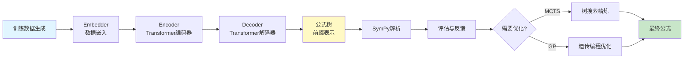
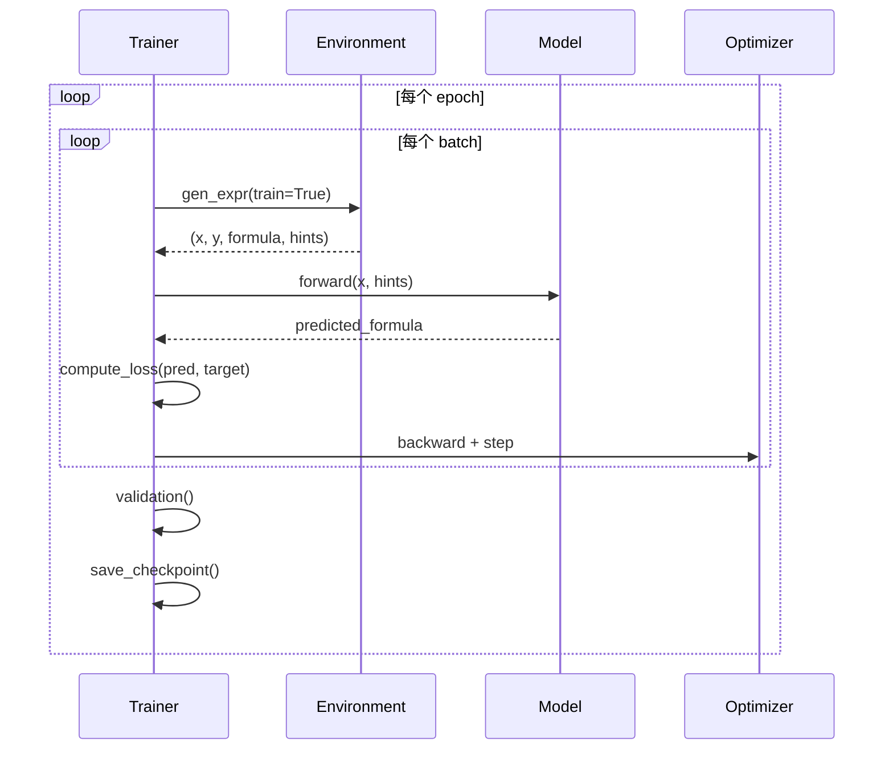
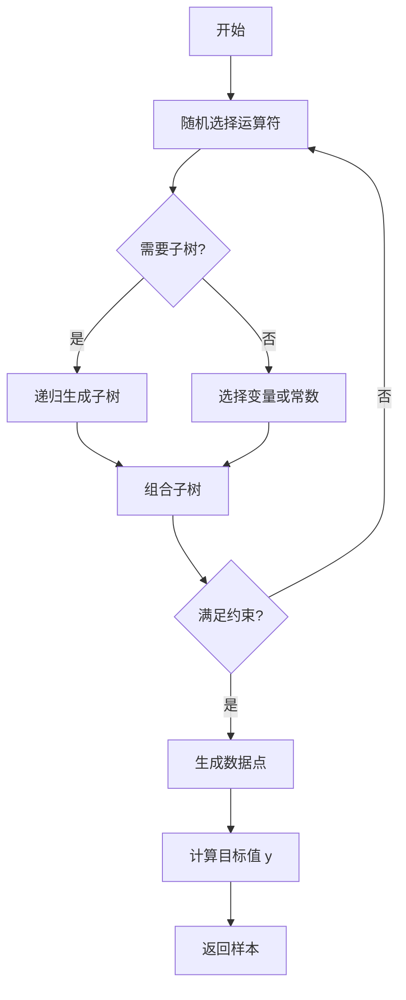
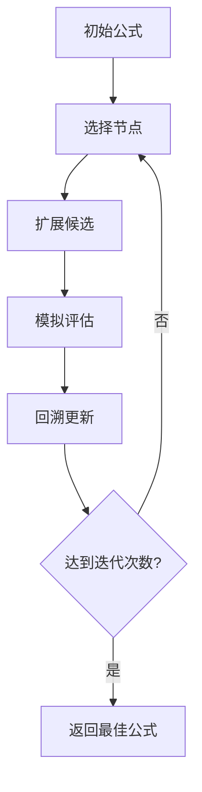
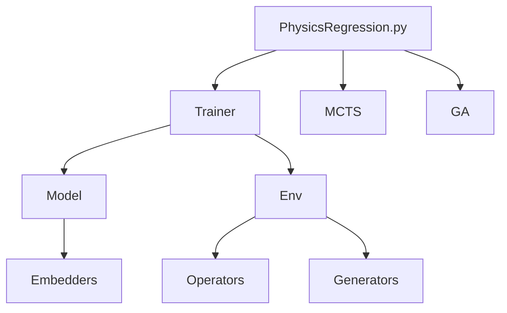

# symbolicregression - 符号回归核心模块

📍 **Root** > **symbolicregression**

---

## 📋 目录

- [模块概览](#模块概览)
- [目录结构](#目录结构)
- [核心架构](#核心架构)
- [公共接口](#公共接口)
- [子模块详解](#子模块详解)
- [依赖关系](#依赖关系)
- [开发指南](#开发指南)

---

## 模块概览

### 职责范围

`symbolicregression` 是项目的核心模块,负责:

1. **端到端符号回归**: 从数据点预测数学公式
2. **Transformer 模型定义**: 编码器-解码器架构
3. **训练环境**: 数据生成、公式编码、运算符定义
4. **优化策略**: MCTS (蒙特卡洛树搜索) 和 GP (遗传编程)
5. **模型训练**: 完整的训练循环和检查点管理

### 核心特性

- **序列到序列学习**: 将数据点序列映射到公式树的前缀表示
- **物理提示支持**: 集成物理单位、复杂度、一元运算等先验知识
- **嵌入策略**: LinearPointEmbedder (当前版本仅实现了此嵌入器)
- **符号计算引擎**: 基于 SymPy 的公式解析和评估
- **灵活的优化**: 支持 MCTS 和 GA 的组合使用

---

## 目录结构

```
symbolicregression/
├── CLAUDE.md                    # 本文档
├── __init__.py                  # 模块初始化
│
├── model/                       # 🧠 模型架构定义
│   ├── __init__.py
│   ├── transformer.py           # Transformer 编码器-解码器 (1242 行)
│   ├── embedders.py             # 数据嵌入层 (LinearPointEmbedder)
│   ├── model_wrapper.py         # 模型包装器 (训练/推理接口)
│   └── sklearn_wrapper.py       # Scikit-learn 风格 API
│
├── envs/                        # 🌍 环境与数据生成
│   ├── __init__.py
│   ├── environment.py           # 主环境类 (946 行)
│   ├── generators.py            # 公式生成器 (随机采样)
│   ├── encoders.py              # 序列编码器
│   ├── operators.py             # 数学运算符定义
│   └── simplifiers.py           # 公式简化器
│
├── MCTS/                        # 🌲 蒙特卡洛树搜索
│   ├── __init__.py
│   └── mcts.py                  # MCTS 算法实现
│
├── GA/                          # 🧬 遗传算法优化
│   ├── __init__.py
│   ├── ga.py                    # 主 GA 逻辑
│   ├── population.py            # 种群管理
│   └── operators.py             # 遗传算子 (交叉、变异)
│
├── trainer.py                   # 🎓 训练循环 (745 行)
├── metrics.py                   # 📊 评估指标 (R², 符号精度等)
├── utils.py                     # 🔧 工具函数
├── optim.py                     # ⚙️ 自定义优化器
├── logger.py                    # 📝 日志记录
└── slurm.py                     # 🖥️ SLURM 集群支持

```

---

## 核心架构

### 整体数据流



### 训练流程



---

## 公共接口

### 核心类

#### 1. `TransformerModel` (model/transformer.py)

**位置**: `symbolicregression/model/transformer.py:182-1028`

**核心 Transformer 模型类**，实现完整的编码器-解码器架构。

**关键方法**:
```python
class TransformerModel(nn.Module):
    def __init__(self, params, id2word, is_encoder, is_decoder, with_output):
        """
        初始化 Transformer 模型

        参数:
            params: 模型配置参数
            id2word: 词汇表索引到词的映射
            is_encoder: 是否为编码器
            is_decoder: 是否为解码器
            with_output: 是否包含输出投影层
        """

    def fwd(self, mode, **kwargs):
        """
        通用前向传播方法

        参数:
            mode: 'fwd'(训练) 或 'predict'(推理)
            **kwargs: x, lengths, causal, src_enc, src_len等

        返回:
            tensor: 输出张量 [seq_len, batch, dim] 或 [batch, seq_len, vocab]
        """

    def predict(self, tensor, pred_mask, y, get_scores):
        """
        预测下一个token

        参数:
            tensor: 编码器输出
            pred_mask: 预测掩码
            y: 目标序列
            get_scores: 是否返回分数
        """

    def generate(self, src_enc, src_len, max_len=200, sample_temperature=None):
        """
        自回归生成公式序列

        参数:
            src_enc: 编码器输出 [src_len, batch, dim]
            src_len: 源序列长度
            max_len: 最大生成长度
            sample_temperature: 采样温度

        返回:
            generated: 生成的序列 [batch, tgt_len]
            lengths: 序列长度
        """

    def generate_beam(self, src_enc, src_len, beam_size=10, length_penalty=1.0):
        """
        束搜索生成（推理时的主要方法）

        参数:
            src_enc: 编码器输出
            src_len: 源序列长度
            beam_size: 束大小 (默认10)
            length_penalty: 长度惩罚系数

        返回:
            generated: 生成的序列 [batch, beam_size, tgt_len]
            lengths: 序列长度
        """
```

**重要配置**:
- `enc_emb_dim` / `dec_emb_dim`: 编码器/解码器嵌入维度 (默认 512)
- `n_enc_layers` / `n_dec_layers`: 编码器/解码器层数 (默认 2/16)
- `n_enc_heads` / `n_dec_heads`: 多头注意力头数 (默认 16)
- `dropout`: Dropout 率 (默认 0.1)
- `attention_dropout`: 注意力 Dropout 率

#### 2. `SymbolicTransformerRegressor` (model/sklearn_wrapper.py)

**位置**: `symbolicregression/model/sklearn_wrapper.py:43-end`

**Scikit-learn 风格的包装器类**，提供更高层的 API 接口。

**关键方法**:
```python
class SymbolicTransformerRegressor(BaseEstimator):
    def __init__(self, env, modules, params):
        """
        初始化包装器

        参数:
            env: Environment 实例
            modules: {'encoder', 'decoder', 'embedder'}
            params: 模型参数
        """

    def fit(self, X, y):
        """训练模型 (当前版本未实现)"""

    def predict(self, X, y):
        """
        预测公式

        参数:
            X: 输入数据 [n_samples, n_features]
            y: 目标值 [n_samples,]

        返回:
            predictions: 预测的公式列表
        """
```

**用途**: 主要用于与 PhyReg 类集成，提供统一的推理接口

#### 3. `Environment` (envs/environment.py)

数据生成和公式管理环境。

**关键方法**:
```python
class Environment:
    def __init__(self, params):
        """
        初始化环境

        设置:
            - 运算符集合
            - 变量范围
            - 物理单位系统
        """

    def gen_expr(self, train=True):
        """
        生成训练/测试数据

        返回:
            {
                'x': 输入数据点,
                'y': 目标值,
                'tree': 公式树,
                'hints': 物理提示
            }
        """

    def word_to_infix(self, words, is_float=True):
        """
        将前缀表示转换为中缀表达式

        参数:
            words: 前缀序列 ['add', 'x_0', 'sin', 'x_1']

        返回:
            infix: 中缀表达式 "x_0 + sin(x_1)"
        """
```

**配置选项**:
- `operators`: 可用运算符 (add, mul, sin, exp, etc.)
- `max_ops`: 最大运算符数量
- `variables`: 变量列表 ['x_0', 'x_1', ...]
- `rewrite_functions`: SymPy 简化规则

#### 4. `Trainer` (trainer.py)

完整的训练循环实现。

**关键方法**:
```python
class Trainer:
    def __init__(self, modules, env, params):
        """
        初始化训练器

        参数:
            modules: {'encoder', 'decoder', 'embedder'}
            env: Environment 实例
            params: 训练参数
        """

    def run(self):
        """
        执行完整训练流程

        - epoch 循环
        - batch 迭代
        - 验证和保存
        """

    def step(self, batch):
        """
        单个训练步骤

        返回:
            loss: 当前 batch 的损失
        """
```

---

## 子模块详解

### 1. model/ - 模型架构

#### transformer.py (1242 行)

**核心类**:
- `TransformerModel`: 主模型类,组合编码器和解码器
- `TransformerEncoder`: Transformer 编码器
- `TransformerDecoder`: Transformer 解码器
- `MultiHeadAttention`: 自定义多头注意力
- `PositionwiseFeedForward`: 前馈网络

**关键特性**:
- 位置编码 (Sinusoidal 或学习型)
- 层归一化
- Dropout 正则化
- 束搜索生成

**使用示例**:
```python
from symbolicregression.model import build_modules

# 构建模型
modules = build_modules(env, params)
encoder = modules['encoder']
decoder = modules['decoder']
embedder = modules['embedder']

# 前向传播
embedded = embedder(x_data)  # [B, L, D]
encoded = encoder(embedded)  # [B, L, D]
output = decoder(encoded, target_formula)  # [B, T, V]
```

---

### 详细网络架构

本节提供各神经网络组件的详细层级结构、维度流转和参数配置。

#### A. MultiHeadAttention 详细架构

**位置**: `transformer.py:58-157`

**层级结构**:
```
输入: x [seq_len, batch, dim]
  ↓
Q/K/V 投影层:
  - q_lin: Linear(dim → dim)
  - k_lin: Linear(src_dim → dim)
  - v_lin: Linear(src_dim → dim)
  ↓
多头分裂:
  - 重塑为 [seq_len, batch * n_heads, dim_per_head]
  - dim_per_head = dim / n_heads
  ↓
缩放点积注意力:
  - scores = (Q @ K.T) / sqrt(dim_per_head)
  - 可选: 归一化
  - weights = softmax(scores + mask)
  - weights = dropout(weights)
  - context = weights @ V
  ↓
多头合并:
  - 重塑为 [seq_len, batch, dim]
  ↓
输出投影:
  - out_lin: Linear(dim → dim)
  ↓
输出: [seq_len, batch, dim]
```

**参数配置表**:
| 层名称 | 类型 | 输入维度 | 输出维度 | 参数数量 |
|--------|------|---------|---------|---------|
| q_lin | Linear | dim | dim | dim² + dim |
| k_lin | Linear | src_dim | dim | src_dim×dim + dim |
| v_lin | Linear | src_dim | dim | src_dim×dim + dim |
| out_lin | Linear | dim | dim | dim² + dim |

**关键参数**:
- `n_heads`: 注意力头数 (默认 16)
- `dim`: 模型维度 (默认 512)
- `dropout`: Dropout 率 (默认 0.1)

---

#### B. TransformerFFN 详细架构

**位置**: `transformer.py:160-179`

**层级结构**:
```
输入: x [seq_len, batch, dim]
  ↓
第一层: lin1 → Linear(dim → hidden_dim) → ReLU → Dropout
  ↓
中间层 (可选): midlin[i] → Linear → ReLU → Dropout
  ↓
最后一层: lin2 → Linear(hidden_dim → dim) → Dropout
  ↓
输出: [seq_len, batch, dim]
```

**关键参数**:
- `dim`: 输入/输出维度 (默认 512)
- `hidden_dim`: 隐层维度 (默认 2048 = 4×dim)
- `hidden_layers`: 总层数 (默认 2)
- `dropout`: Dropout 率 (默认 0.1)

---

#### C. TransformerModel 完整架构

**位置**: `transformer.py:182-1028`

**整体结构**:
```
词嵌入层 (可选):
  - embeddings: Embedding(n_words, dim)
  - position_embeddings: Sinusoidal/Learnable
  - layer_norm_emb: LayerNorm(dim)

Transformer层 (× n_layers):
  - attentions[i]: MultiHeadAttention (自注意力)
  - layer_norm1[i]: LayerNorm(dim)
  - [仅解码器] encoder_attn[i]: MultiHeadAttention (交叉注意力)
  - [仅解码器] layer_norm15[i]: LayerNorm(dim)
  - ffns[i]: TransformerFFN
  - layer_norm2[i]: LayerNorm(dim)

输出层 (with_output=True):
  - proj: Linear(dim, n_words)
```

**关键配置**:
- **编码器**: `is_encoder=True, is_decoder=False, with_output=False`
- **解码器**: `is_encoder=False, is_decoder=True, with_output=True`

**物理单位编码 (double-seq 模式)**:
```python
# 5维物理单位向量 [kg, m, s, T, V]
units_embedding = units_enc(units_vector)  # [5] → [dim]
tensor = tensor + units_embedding
```

---

#### D. LinearPointEmbedder 详细架构

**位置**: `embedders.py:41-end`

**层级结构**:
```
输入: data_points [batch, n_points, n_vars+1]
  ↓
1. 浮点数编码 (num_encode):
   每个浮点数 → [sign, exp, mantissa_digits...]
  ↓
2. 初始嵌入:
   embed: Linear((n_vars+1)*num_encoding_dim → emb_dim)
  ↓
3. 压缩网络 (可选):
   compress: Linear → ReLU → Linear → ReLU...
  ↓
4. 物理提示编码 (hint_encode):
   - units: Linear(5 → emb_dim)
   - complexity: Linear(1 → emb_dim)
   - unarys: Linear(n_unary → emb_dim)
  ↓
输出: [batch, n_points + n_hints, emb_dim]
```

**浮点数编码示例**:
```python
# 3.14 → [0(正号), 20(指数+偏移), 1, 5, 7, 0, 0, ...]
```

**参数配置**:
- `num_encoding_dim`: 每个浮点数编码长度 (默认 10)
- `emb_dim`: 嵌入维度 (默认 512)
- `n_compress_layers`: 压缩网络层数 (默认 2)

---

### 完整推理流程的维度流转

```
示例: batch=4, n_points=100, n_vars=2, emb_dim=512, vocab=1000

1. 数据嵌入:
   xy_data: (4, 100, 3) → LinearPointEmbedder → (4, 103, 512)

2. 编码器:
   (103, 4, 512) → TransformerModel(encoder) → (103, 4, 512)

3. 解码器 (自回归生成):
   初始: [<BOS>] (1, 4) → Embedding → (1, 4, 512)
   → TransformerModel(decoder) → (1, 4, 1000)
   → argmax → next_token (1, 4)
   重复直到 <EOS>

4. 输出:
   generated_formula: (4, max_len)
```

---

#### embedders.py

**位置**: `symbolicregression/model/embedders.py`

**当前实现的嵌入器**:

1. **LinearPointEmbedder** (embedders.py:41-end): 线性数据点嵌入
   ```python
   # 输入: [batch, n_points, n_vars]
   # 输出: [batch, n_points, emb_dim]
   ```

**功能**:
- 将 (x, y) 数据点序列嵌入到高维空间
- 支持浮点数编码 (符号、指数、尾数分离)
- 集成物理提示编码 (单位、复杂度、一元运算)
- 可选的压缩网络层

**注意**: 项目早期计划中包含 TNet 和 AttentionPoint 嵌入器，但当前版本仅实现了 LinearPointEmbedder

### 2. envs/ - 环境与数据生成

#### environment.py (946 行)

**主要职责**:
1. **公式生成**: 随机生成符合约束的数学公式
2. **数据采样**: 从公式生成 (x, y) 数据点
3. **编码**: 公式树转前缀序列
4. **解码**: 前缀序列转公式树

**公式生成流程**:


**关键约束**:
- `max_ops`: 最大运算符数
- `units`: 物理单位一致性
- `complexity`: 复杂度要求
- `unarys`: 允许的一元运算

#### operators.py

**运算符定义**:

```python
# 二元运算符
BINARY_OPS = {
    'add': ('+', 1),      # (符号, 优先级)
    'sub': ('-', 1),
    'mul': ('*', 2),
    'div': ('/', 2),
    'pow': ('**', 3),
}

# 一元运算符
UNARY_OPS = {
    'sin': 'sin',
    'cos': 'cos',
    'exp': 'exp',
    'log': 'log',
    'sqrt': 'sqrt',
    'abs': 'abs',
}
```

**单位传播**:
```python
# 例: y = x_0 * x_1
# x_0 单位: kg1m0s0
# x_1 单位: kg0m1s-1
# y 单位: kg1m1s-1 (相乘)

def propagate_units(op, units_left, units_right):
    """计算运算后的单位"""
    if op == 'mul':
        return [u1 + u2 for u1, u2 in zip(units_left, units_right)]
    # ... 其他规则
```

### 3. MCTS/ - 蒙特卡洛树搜索

#### mcts.py

**MCTS 精炼策略**:



**关键参数**:
- `n_iterations`: 搜索迭代次数 (默认 100)
- `exploration_weight`: 探索权重 (默认 1.0)
- `beam_size`: 束大小

**使用场景**:
- 公式预测置信度低时
- 需要局部优化时
- 复杂公式的精炼

### 4. GA/ - 遗传算法优化

#### ga.py

**遗传编程流程**:

```python
# 1. 初始化种群
population = initialize_population(initial_formulas)

# 2. 迭代进化
for generation in range(n_generations):
    # 3. 评估适应度
    fitness = evaluate_population(population, x, y)

    # 4. 选择
    parents = tournament_selection(population, fitness)

    # 5. 交叉
    offspring = crossover(parents)

    # 6. 变异
    offspring = mutate(offspring, mutation_rate)

    # 7. 替换
    population = elitism_replacement(population, offspring)

# 8. 返回最优解
best = max(population, key=fitness)
```

**遗传算子**:
- **交叉**: 子树交换
- **变异**: 节点替换、子树插入
- **简化**: SymPy 自动简化

---

## 依赖关系

### 内部依赖



### 外部依赖

**核心依赖**:
- `torch >= 2.0.1`: Transformer 模型
- `numpy >= 1.24.3`: 数值计算
- `sympy >= 1.13.3`: 符号数学
- `scipy >= 1.10.1`: 优化算法

**可选依赖**:
- `sympytorch`: SymPy 与 PyTorch 集成
- `pysr`: PySR 初始化支持

---

## 开发指南

### 添加新运算符

**步骤**:
1. 在 `envs/operators.py` 中注册:
   ```python
   UNARY_OPS['tanh'] = 'tanh'
   ```

2. 在 `envs/environment.py` 中添加单位规则:
   ```python
   def propagate_units_unary(op, units):
       if op == 'tanh':
           # tanh 保持单位
           return units
   ```

3. 更新 SymPy 重写规则 (如需要):
   ```python
   rewrite_functions.append(
       (sp.tanh, lambda x: (sp.exp(x) - sp.exp(-x)) / (sp.exp(x) + sp.exp(-x)))
   )
   ```

### 自定义嵌入器

**实现接口**:
```python
import torch.nn as nn

class CustomEmbedder(nn.Module):
    def __init__(self, params):
        super().__init__()
        self.input_dim = params.n_vars
        self.output_dim = params.enc_emb_dim
        # 定义网络层

    def forward(self, x):
        """
        参数:
            x: [batch, n_points, n_vars]
        返回:
            embedded: [batch, n_points, emb_dim]
        """
        # 实现嵌入逻辑
        return embedded
```

**注册到 `model_wrapper.py`**:
```python
from .embedders import CustomEmbedder

def build_modules(env, params):
    if params.embedder == 'custom':
        embedder = CustomEmbedder(params)
    # ...
```

### 训练技巧

**1. 调整批次大小**:
```bash
# GPU 内存不足时
python train.py --tokens_per_batch 10000  # 默认 20000

# 增加训练步数补偿
python train.py --n_steps_per_epoch 1000  # 默认 500
```

**2. 使用预训练模型**:
```python
from PhysicsRegression import PhyReg

# 加载预训练
model = PhyReg("model.pt")

# 继续训练
model.fit(x, y, continue_training=True)
```

**3. 调试模式**:
```python
# 设置详细日志
params.log_level = "DEBUG"

# 保存中间结果
params.save_intermediate = True
```

### 测试

**运行测试**:
```bash
# 单元测试
pytest symbolicregression/tests/

# 模型测试
python -m symbolicregression.model.test_transformer

# 环境测试
python -m symbolicregression.envs.test_environment
```

### 性能优化

**1. 数据加载**:
- 使用 `num_workers > 0` 并行加载
- 预生成数据缓存

**2. 模型推理**:
- 使用 `torch.jit.script` 编译
- 减少束搜索大小

**3. 内存管理**:
- 使用梯度累积
- 启用混合精度训练 (AMP)

---

## PaddlePaddle 迁移注意事项

### 关键替换

| PyTorch | PaddlePaddle | 文件 |
|---------|--------------|------|
| `torch.nn.TransformerEncoder` | `paddle.nn.TransformerEncoder` | transformer.py:245 |
| `torch.nn.MultiheadAttention` | `paddle.nn.MultiHeadAttention` | transformer.py:312 |
| `torch.optim.Adam` | `paddle.optimizer.Adam` | trainer.py:156 |
| `torch.utils.data.DataLoader` | `paddle.io.DataLoader` | trainer.py:89 |

### 数值差异检查

**位置**:
- `model/transformer.py:567` - 位置编码
- `envs/environment.py:234` - 数据采样
- `trainer.py:423` - 损失计算

**验证方法**:
```python
# 对比 PyTorch 和 PaddlePaddle 输出
torch_output = torch_model(x)
paddle_output = paddle_model(x)
diff = np.abs(torch_output - paddle_output).max()
assert diff < 1e-5, f"数值差异过大: {diff}"
```

---

**最后更新**: 2026-01-22
**维护者**: PhysicsRegression Team
**相关文档**: [根目录 CLAUDE.md](../CLAUDE.md) | [Oracle 模块](../Oracle/CLAUDE.md) | [物理案例](../physical/CLAUDE.md)
